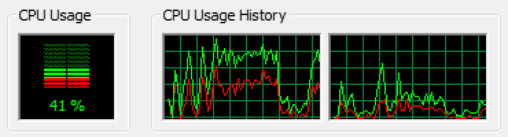
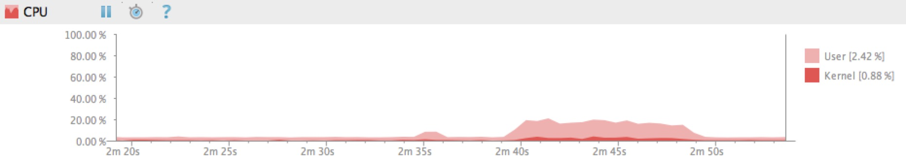

---

layout: post
title: 理解User和Kernel两种模式
tags: [OS]

image: 
   background: triangular.png
---

# 理解User和Kernel两种模式

大多数系统都有一些可以展示CPU当前使用率的方法:
 
 * 在Windows系统的任务管理器中可以看到
 * 在AndroidStudio的Monitors中可以看到

通常来说，CPU资源的使用率的大小可以简单的描述成CPU空闲时间所占的百分比。但是这种说法也太简单化了，在所有现代的操作系统中（老式的Doc系统不存在以下两种模式），CPU资源的使用都是在以下两种模式下严格执行的。

 * ### Kernel Mode
	在Kernel Mode中，执行程序可以完全不受限制的访问硬件所有资源。它可以执行任何CPU指令和引用任何内存地址。这种模式对应x86的ring0层，操作系统的核心部分，包括设备驱动程序都运行在该模式。在Kernel Mode里崩溃是惨重的，它会直接导致整个系统停止运行。

 * ### User Mode
   当CPU运行于User Mode时，执行程序是没有权限去直接访问硬件或者内存。在该模式下运行的程序必须代理系统给定的API 去访问硬件和内存。就是在这样的一种隔离机制下，执行在User Mode下的程序崩溃。这种模式对应于x86的ring3层，操作系统的用户接口部分以及所有的用户应用程序都运行在该级别。

## 参考
[User And Kernel Mode](https://blog.codinghorror.com/understanding-user-and-kernel-mode/)
