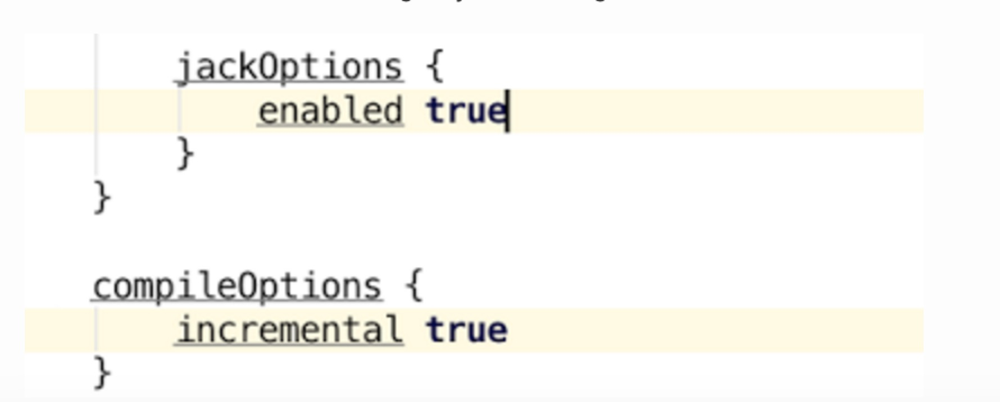
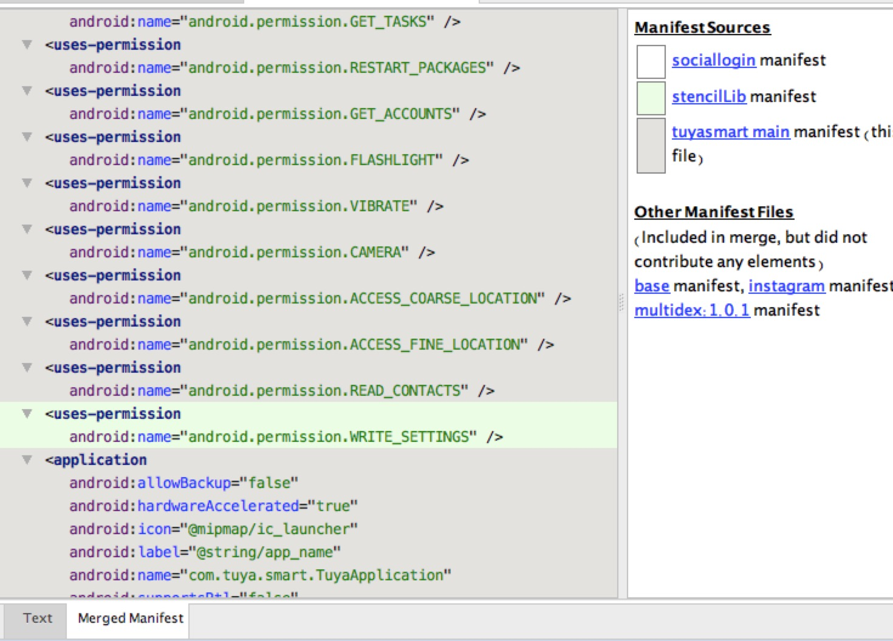
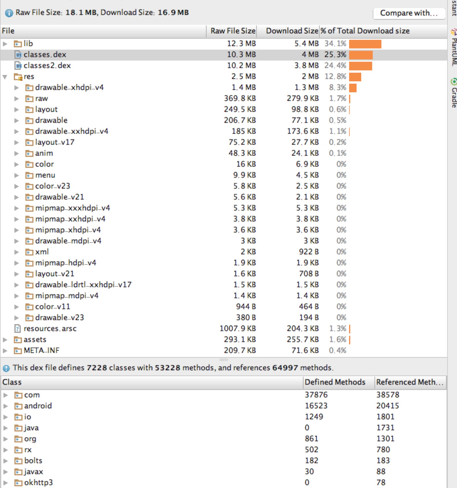
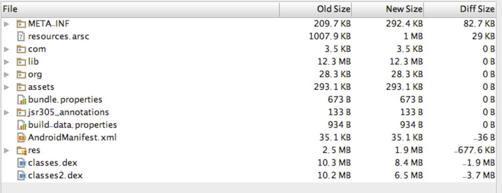

---

layout: post
title: Android Studio 2.2新特性
tags: [Android Studio]
image: 
   background: triangular.png
---

# Android Studio 2.2新特性

## 设计

## 开发

## 编译

### Jack工具优化
最新Jack工具把Java代码编译成Android可以识别的字节码，Jack工具支持Java8的一些新特性:lambdas表达式等。这个studio 版本增加了增量编译(incremental build) 而且对注解全面支持，这样你就可以在项目中使用Java8的新特性。

#### gradle配置
开启增量编译，需要进行以下gradle编译:

### 全局Manifest浏览工具

通过这个工具可以很轻松看到打包之后当前module以及其父module合并后的AndroidManifest文件

## 测试

## APK分析工具
这个工具简单实用，查看类库代码数非常方便，而且还有app包体积分析。

### APK包分析
点击 `Build` 按钮，选择 `Analyze APK`,然后就会看到下图

|File|Raw File Size | Download Size      | % of Total Download size  |
|:---:|:-------------:|:-------------:|:-----:|
|----
|文件名称| 源文件大小 | 打包后大小           |  体积占比 |

### 不同APK对比

右上角`Compare with...` 按钮可以和其他apk进行代码数对比，这样可以很方便的看出混淆包和非混淆前包的区别。

## 原文参考
[Android Studio 2.2 Preview](http://android-developers.blogspot.fr/2016/05/android-studio-22-preview-new-ui.html)

